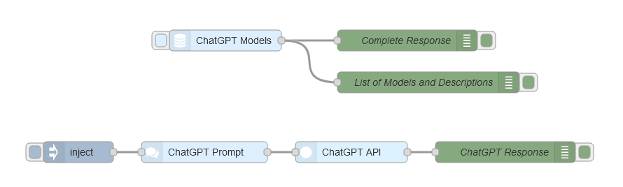

# node-red-contrib-chatgpt-api
A Node-RED node for interacting with the OpenAI ChatGPT API.
Supports creating prompts, retrieving models, and generating AI-driven completions.

## Features

- Easily interact with OpenAI's ChatGPT API for intelligent, chat-based completions.
- Customize model, temperature, and token limits.
- Requires an OpenAI API key: Get yours from the [OpenAI Platform](https://platform.openai.com/docs/overview/).
- Lightweight implementation using Node.js's native https module.

## Installation

Install the nodes directly through Node-RED's built-in palette manager.

## Nodes

- **gptapi**: Calls the ChatGPT API to generate completions
- **gptprompt**: Helps construct the prompt.
- **gptmodels**: Retrieves the list of available models from the OpenAI API.

## Usage

1. Drag the **gptapi** node from the palette into your Node-RED workspace.
2. Double-click the node to open the configuration panel:
   - Enter your **OpenAI API Key**. If you don’t have one, visit the [OpenAI Platform](https://platform.openai.com/docs/overview/) to generate it.
   - Specify a model in the node or in the input payload, e.g., **gpt-4**.
   - Optionally set values for **temperature** and **maximum tokens**.
3. Use the **gptmodels** node to retrieve a list of available models.
4. Use the **gptprompt** node to configure a multi-part structured prompt and pass it to the **gptapi** node as `msg.prompt`.
5. The **gptapi** node returns the API response in `msg.payload`.

## Example Flow
The example flow demonstrates how to use the nodes together:

You can import it from the repository to get started quickly.